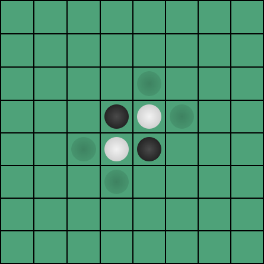
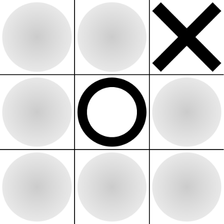

[](https://maven-badges.herokuapp.com/maven-central/com.github.thowv.javafxcomps/grid-game-board-framework)

# Game board framework

A framework for creating grid-based board games using JavaFX.  
This project includes two simple premade board games: Reversi and Tic Tac Toe.  
Both board games can be found in the [premades package](https://github.com/ThowV/game-board-framework/tree/master/src/main/java/com/thowv/javafxgridgameboard/premades) and be seen used in the [examples package](https://github.com/ThowV/game-board-framework/tree/master/src/main/java/com/thowv/javafxgridgameboard/examples).

Reversi | Tic Tac Toe
---|---
 | 

## Getting Started

These instructions will get you a copy of the project up and running on your local machine.

### Installing

If you haven't set up maven in your project yet, you can see how to do so [here](https://www.tutorialspoint.com/maven/maven_environment_setup.htm).  
If you are using maven for your project and have a pom.xml ready, you can insert the following:

```
<dependency>
  <groupId>com.github.thowv.javafxcomps</groupId>
  <artifactId>grid-game-board-framework</artifactId>
  <version>(See badge version)</version>
</dependency>
```

Maven should now automatically add the dependency to your external libraries.

## Built using 

* [JavaFX](https://openjfx.io/) - The client framework
* [Maven](https://maven.apache.org/) - Dependency Management

## Authors

* **Thomas Visscher** - [ThowV](https://github.com/ThowV)

## License

This project is licensed under the GPLv3 License - see the [LICENSE](LICENSE) file for details.
